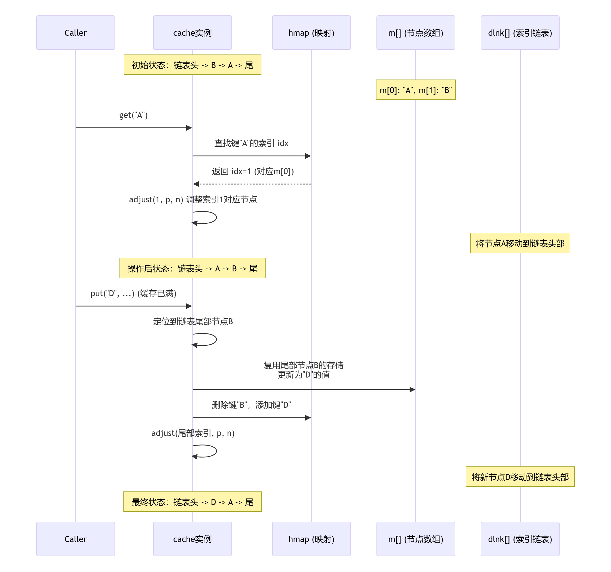

# cache 设计说明

这段代码实现了一个**高性能**、**内存紧凑**的**LRU缓存**。

通过减少**内存分配**、**优化时钟获取**、**使用紧凑数据结构**等方式，旨在实现**高性能**和**低GC压力**。

## 自定义时钟优化

代码实现了一个自定义的时钟机制，目的是减少频繁调用 time.Now().UnixNano() 带来的性能开销。

```go
var clock, p, n = time.Now().UnixNano(), uint16(0), uint16(1)

func Now() int64 { return atomic.LoadInt64(&clock) }

func init() {
    go func() {
        for {
            atomic.StoreInt64(&clock, time.Now().UnixNano()) // 每秒校准一次
            for i := 0; i < 9; i++ {
                time.Sleep(100 * time.Millisecond)
                atomic.AddInt64(&clock, int64(100*time.Millisecond)) // 每100毫秒原子递增
            }
            time.Sleep(100 * time.Millisecond)
        }
    }()
}
```

- **工作原理**：启动一个独立的`goroutine`，每秒用系统时间校准一次全局变量`clock`，在此之前（每100毫秒）通过原子操作递增其值，从而避免频繁的系统调用。
- **意义**：
    - **降低系统调用开销**：直接调用`time.Now()`涉及系统调用，相对较重。自定义时钟通过组合一次系统调用和九次原子操作，显著降低了系统开销。
    - **保证并发安全**：使用`atomic`包操作`clock`变量，保证了在多个`goroutine`环境下的读取安全。


---

## 哈希函数与掩码计算

- `hashBKRD` 函数实现了经典的 ​BKDR 哈希算法​，用于**将字符串键转换为整数哈希值**。

```go
func hashBKDR(s string) (hash int32) {
	for i := 0; i < len(s); i++ {
		hash = hash*131 + int32(s[i]) // 131 是一个常用的质子种子
	}
	return hash
}
```

- `maskOfNextPowOf2` 函数通过位运算计算一个掩码（大于或等于输入容量的最小2的幂次方减一）。

```go
func maskOfNextPowOf2(cap uint16) uint16 {
    if cap > 0 && cap&(cap-1) == 0 {
		return cap - 1
	}
	cap |= cap >> 1
	cap |= cap >> 2
	cap |= cap >> 4
	return cap | (cap >> 8)
}
```

- **意义**​：
    - **​均匀分布**​：BKDR哈希算法有助于将键均匀分布，减少哈希冲突。
    - **高效取模**​：掩码计算使得后续的取模操作（如 hash & mask）可以转换为更快的按位与运算，提升性能。


---

## 核心缓存结构

- `cache` 结构体是核心，其设计紧凑，旨在减少内存分配和GC压力。

```go
type cache struct {
    dlnk [][2]uint16       // 双向链表，存储的是前驱和后继节点的索引
    m    []node            // 节点存储数组，预分配内存
    hmap map[string]uint16 // 键到节点索引的映射
    last uint16            // 记录最后一个节点元素的索引
}

type node struct {
    k        string
    v        Value
    expireAt int64 // 过期时间戳
}
```

**关键设计点** —— **索引化的双向链表**

- `dlnk` 是一个二维数组，其每个元素`[2]uint64`存储的是一个某个节点的`前驱([0])`和`后继([1])`节点在数组中的`索引`。
- `m` 是实际存储键值对和过期时间的节点数组。
- `hmap` 通过键快速定位到节点在`m`中的索引。

通过索引关联链表和节点数据，**避免了为链表节点额外分配内存**，所有数据都在初始化时分配完成，极大减轻了 GC 负担。

---

## LRU 操作逻辑

核心的 `get` 和 `put` 操作都依赖于 `adjust` 方法来调整节点在链表中的位置，实现 `LRU` 逻辑。

- ​**get 操作**​：当访问一个已存在的键时，adjust(idx, p, n) 将该节点移动到链表头部（p=0 代表前驱，n=1 代表后继，指向头部）。
- ​**put 操作**​：
    - **​更新现有键**​：类似 get，调整节点到头部。
    - **​新增键且缓存未满**​：在数组末尾创建新节点，插入链表头部。
    - **新增键且缓存已满**​：​淘汰链表尾部节点​（通过 c.dlnk[0][p] 找到尾部），复用该节点的存储空间，并将其新内容插入链表头部。

这种设计确保了最近访问的节点在链表头部，最久未访问的在尾部，淘汰时直接淘汰尾部节点。

---

## 代码设计的核心意义

这个缓存实现的意义主要体现在以下几点：

1. **极致性能与低GC压力​**：通过预分配内存、索引化链表、自定义时钟等手段，最大限度地减少了运行时内存分配和系统调用，非常适合高性能场景。
2. **内存紧凑**：使用 uint16 作为索引，如果缓存容量不超过 65535，可以比使用指针更节省内存。
3. **准确的LRU语义**：通过双向链表严格维护访问顺序，确保淘汰的是最久未使用的项。

需要注意的是，这种高度优化的设计也带来了更复杂的代码逻辑，并且缓存容量被限制在最大 65535（uint16 的最大值）。

---


## 核心逻辑图示

为了更直观地理解 `get` 和 `put` 操作如何通过 `adjust` 方法维护 `LRU` 顺序，特别是索引化的链表如何工作，可以参考下面的序列图，它描绘了 `get("A")` 和 `put("D", ...)` 时的主要交互过程：



---